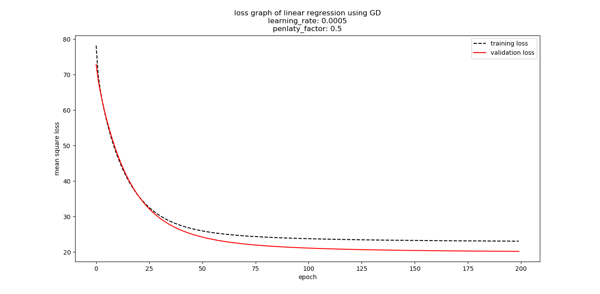

# Linear Regression and Stochastic Gradient Descent

## Abstract
In this report, we will solve linear regression using both the closed-form solution and gradient descent method based on a small dataset.
After that, we will further learn to tune some parameters such as the learing rate to optimizate our gradient descent model.  

## I.Introduction
In statistics, linear regression is a linear approach to modelling the relationship between a scalar response (or dependent variable) and one or more explanatory variables (or independent variables). The case of one explanatory variable is called simple linear regression.\[[1](linear_regression Wikipidea)\]

Motivations of the report are listed below:
* Further understand of linear regression ，closed-form solution and Stochastic gradient descent.
* Conduct some experiments under small scale dataset.
* Realize the process of optimization and adjusting parameters.

## II.Methods and Theory
The equation of simple linear regression can be described as:<br/>
<br/>

Let 
and then equation (1) can be changed into <br/>
<br/>

The mean square loss of simple linear regression is <br/>


The corresponding gradient with respect to  in simple linear regression is
 
 

To minimize the mean square loss Lreg, we can use closed-formed solution or the gradient descent method.

### Closed-formed Solution
let , we can get


if the matrix  is a full-rank matrix or a positive definite matrix, then its **inverse matrix** exists.
Thus we can use the equation (5) to calculate the best weight vector .

### Gradient Descent Method
However, in most cases the inverse matrix of a given matrix may not exist.
So the closed-form solution can't always work. Gracefully, gradient descent can help.

**Gradient Descent (GD)** tries to minimize the loss function by updating weight vector to minimize the learning rate  muplitying the correspondent gradient with respect to weighted vector in the loss function.


In our linear regression model, it looks like this:


With regularization, the loss function (3) can be changed into the objective function
<br/><br/>
Then equation (7) becomes
<br/><br/>

### Comparison with Closed-form Solution and Gradient Descent Method 

||Closed-form Solution|Gradient Descent Method|
|:-:|:-:|:-:|
|Advantages|Mathematic simplication|Easy to perform|
|Disadvantages|Cannot always work<br>Calculating the inverse matrix is low efficent and consums a lot of time|

latex equation


## III.Experiment

### A.Dataset
In this experiment, to perform linear regression we uses [housing_scale](https://www.csie.ntu.edu.tw/~cjlin/libsvmtools/datasets/regression.html#housing) in [LIBSVM Data](https://www.csie.ntu.edu.tw/~cjlin/libsvmtools/datasets/), including 506 samples and each sample has 13 features. The dataset is then divided into train set and validation set.

### B.Experiment Step

#### closed-form solution of Linear Regression
1. Load the housing_scale dataset and divide it into training set and validation set.
2. Initialize linear model parameters. Set all parameter into zero, initialize it randomly or with normal distribution.
3. Select the mean square loss as the loss function and calculate mean square loss of the training set with the weight vector, denoted as **Loss**.
4. Use the formula of the closed-form solution (5) to get the best weighted vector.
5. Get the **Loss**, **Loss_train** under the training set and **Loss_val**  by validating under validation set and output them.

##### Core Code of closed-form solution

```python
import numpy as np
from sklearn.metrics import mean_squared_error
def linear_reg_closed_form(X_train, y_train, X_val, y_val):
    '''Use the closed-form solution to solve simple linear regression.
    Attention: This function may not work because the inverse of a given matrix may not exist.
    :param X_train: train data, a (n_samples, n_features + 1) ndarray, where the 1st column are all ones, ie.numpy.ones(n_samples) 
    :param y_train: labels, a (n_samples, 1) ndarray
    :param X_val: validation data
    :param y_val: validation labels
    :return w: the weight vector, a (n_features + 1, 1) ndarray
    '''

    n_features = X_train.shape[1]

    # init weight vector
    w = np.zeros((n_features, 1))
    # w = np.random.random((n_features, 1))
    # w = np.random.normal(1, 1, size=(n_features, 1))

    loss0 = mean_squared_error(y_true=y_train, y_pred=np.dot(X_train, w))

    w = np.dot(np.dot((np.mat(np.dot(X_train.T, X_train)).I).getA(), X_train.T), y_train)

    loss1 = mean_squared_error(y_true=y_train, y_pred=np.dot(X_train, w))
    loss_train = mean_squared_error(y_train, np.dot(X_train, w))
    loss_val = mean_squared_error(y_val, np.dot(X_val, w))

    return w, loss0, loss1, loss_train, loss_val
```

#### Gradient Descent
1. Load and divide dataset.
2. Initialize linear model parameters. Set all parameter into zero, initialize it randomly or with normal distribution.
3. Choose mean square loss as the loss function. 
4. Calculate the gradient with respect to weight in the objective funtion from each example using equation (8). Denote the opposite direction of gradient as D.
5. Update model: .
6. Get the loss **loss_train** under the training set and **loss_val** by validating under validation set.
7. Repeate step 4 to 6 for several times, and use the values of **loss_train** and **loss_val** to plot the loss graph. 

##### Core Code of Gradient Descent

```python
import numpy as np
from sklearn.metrics import mean_squared_error
def linear_reg_GD(X_train, y_train, X_val, y_val, max_epoch=200, learning_rate=0.01, penalty_factor = 0.5):
    '''Use the gradient descent method to solve simple linear regression.
    :param X_train: train data, a (n_samples, n_features + 1) ndarray, where the 1st column are all ones, ie.numpy.ones(n_samples)
    :param y_train: labels, a (n_samples, 1) ndarray
    :param X_val: validation data
    :param y_val: validation labels
    :param max_epoch: the max epoch for training
    :param learning_rate: the hyper parameter to control the velocity of gradient descent process, also called step_size
    :param penalty_factor: the L2 regular term factor for the objective function

    :return w: the weight vector, a (n_features + 1, 1) ndarray
    :return losses_train: the mean square loss of the training set during each epoch
    :return losses_val: the mean square loss of the validation set during each epoch
    '''

    n_features = X_train.shape[1]
    # init weight vector
    w = np.zeros((n_features, 1))
    # w = np.random.random(n_features)
    # w = np.random.normal(1, 1, size=(n_features, 1))

    losses_train = []
    losses_val = []

    for epoch in range(0, max_epoch):
        d = -penalty_factor * w + np.dot(X_train.T, (y_train - np.dot(X_train, w)))
        w += learning_rate * d

        loss_train = mean_squared_error(y_true=y_train, y_pred=np.dot(X_train, w))
        loss_val = mean_squared_error(y_true=y_val, y_pred=np.dot(X_val, w))
        losses_train.append(loss_train)
        losses_val.append(loss_val)

        print("at epoch [{:4d}]: loss_train = [{:.6f}; loss_val = [{:.6f}]".format(epoch, loss_train, loss_val))

    return w, losses_train, losses_val
```

### C.Experiment Result

#### Ouput Results of the closed-form solution 
For this small dataset with 13 features and 506 samples, the closed-form solution can easily and quickly calculate the desired weight vector and generate output results.

>
    closed-form solution for linear regression
	     loss0 = 605.933852
	     loss1 = 23.476533
	loss_train = 23.476533
	  loss_val = 18.176029

#### Result of the gradient descent
With carefully selecting suitable hyper parameters learning_rate and penalty_factor,
the gradient descent method can minimize the mean square loss in a certain number of epoches
to a low level.



##### Tuning the learning rate
In the gradient descent method, the learning rate is a important parameter to control the velocity of the gradient descent process, 
which affects the performance a lot. The following two graphes show the details.


## IV.Conclusion

## Reference
1.[linear_regression Wikipidea](https://en.wikipedia.org/wiki/Linear_regression)

