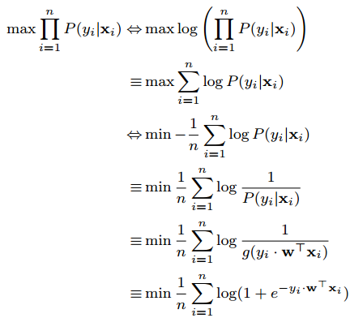

# Logistic Regression and Support Vector Machine

## Abstract
In this report, we will solve **binary classification** using both **logistic regression** and **support vector machine (SVM)**.

## 1.Introduction
**Binary Classification** is one of the most fundamental problems in machine learning.
**Logistic Regression (LR)** and **Support Vector Machine (SVM)** are two efficent and powerful tools to solve binary classification.
Logistic regression try to model a function to predict the probility of a sample to be in the postive or negative class 
while support vector machine is aimed to find a hyperplane which will seperate the postive samples and negative samples.

In this report, we will first explain the methodology of both logistic regression and support vector machine.
Then a variant of Gradient Descent called **Mini-batch Stochastic Gradient Descent (MSGD)** is used to implement the two above methods.

Motivations of Experiment are listed below:
1. Compare andand understand the difference between gradient descent and batch random stochastic gradient descent.
2. Compare and understand the differences and relationships between Logistic regression and linear classification.
3. Further understand the principles of SVM and practice on larger data.    

## 2.Methods and Theory

### 2.1. Mini-batch Stochastic Gradient Descent
Mini-batch Stochastic Gradient Descent updates weight vector using the gradient with respect to weight in the objective function
but each time it select a mini batch of samples to perform updating instead of using all the samples as gradient descent.

 
  

### 2.2. Logistic Regression
The equation of logistic regression can be described as: 
 

where g(z) is the logisitc function,  

Let 
and then equation (2) can be changed into 
 

With equation (3), we can get 
 

if we regard **y** in **equation (6)** to be the posterior probability of 
,
then equation (6) can be transformed into  

where , 

Using the Maximum Log Likelihood Estimate, we can have the objective function  

After the above induction and regularization, we update our objective funtion to

and we can update weight vector using mini-batch gradient descent: 

### 2.3. Support Vector Machine

## 3.Experiment

### 3.1. Dataset
In this experiment, to perform binary classification we uses [a9a](https://www.csie.ntu.edu.tw/~cjlin/libsvmtools/datasets/binary.html#a9a) in [LIBSVM Data](https://www.csie.ntu.edu.tw/~cjlin/libsvmtools/datasets/), including 32561/16281(testing) samples and each sample has 123 features.
a9a_t is a9a's validation dataset.

### 3.2. Experiment Step

### 3.2.1. Logistic Regression
1. Load the training set and validation set.
2. Initialize logistic regression model parameter with zeros, random numbers or normal distribution.
3. Determine the size of the batch_size and randomly take some samples,calculate gradient G toward loss function from partial samples.
4. Use the **MSGD** optimization method described in **equation (12)** to update the parametric model.
5. Predict under validation set and get the loss **L_val** using **equation (11)**.
6. Repeat step 3 to 5 for several times, and drawing graph of **L_val**  with the number of iterations.

<!-- 5. Select the appropriate threshold, mark the sample whose predict scores greater than the threshold as positive, on the contrary as negative. Predict under validation set and get the loss **L_val**. -->

## 4.Conclusion

## References

instead of   

