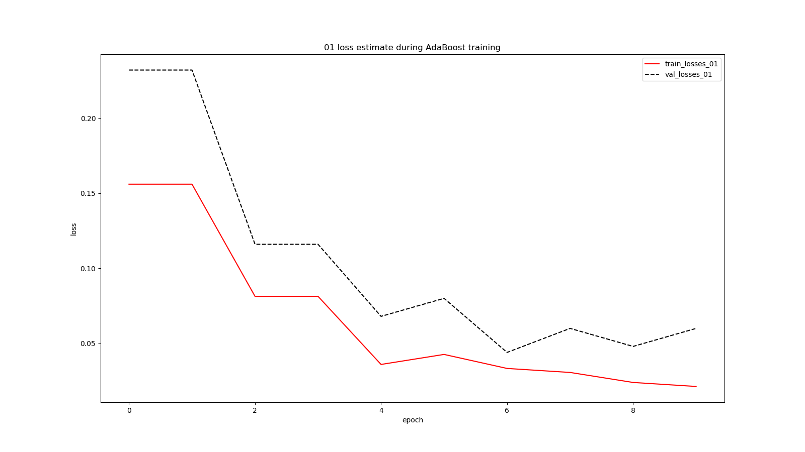
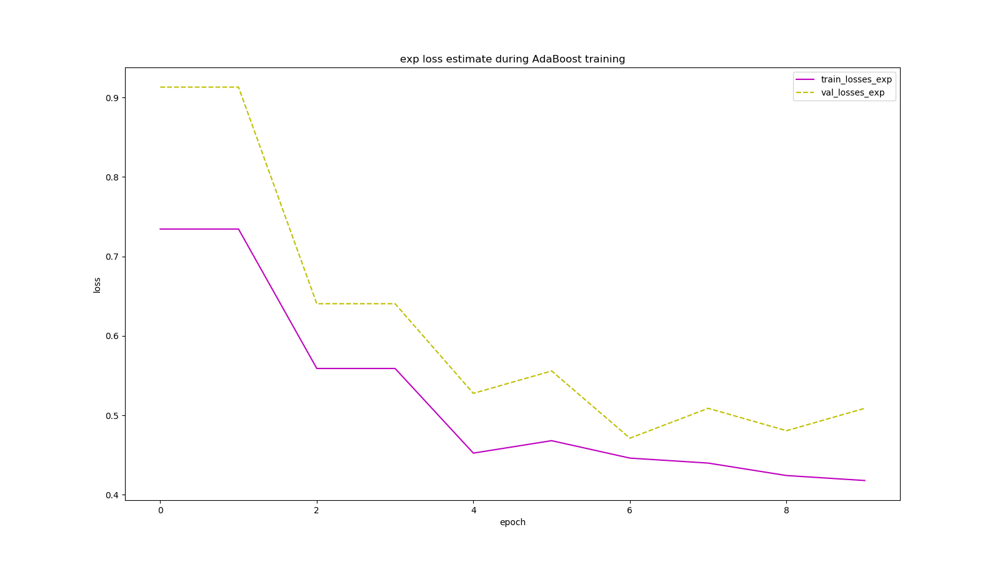

# Face Detection Based on AdaBoost Algorithm

## Abstract
**AdaBoost** is one of the most classic **Boosting** methods. 
In this report, we will try to solve a face classification problem based on a small dataset using AdaBoost. 
A few theory and methodology of **AdaBoost** will be exhibited, followed by several experiments.  

## 1.Introduction
**Boosting** is a machine learning ensemble meta-algorithm for primarily reducing bias, and also variance in supervised learning, and a family of machine learning algorithms that convert weak learners to strong ones.[7]

**AdaBoost**, short for **Adaptive Boosting**, is a Boosting method using exponential loss function which emphasize samples classified incorrectly in the previous training epoches. 

In this report, we will first explain the methodology of AdaBoost.
Equipped with the powerful tool of AdaBoost, we will solve a face classification problem and then perform face detection with cv2 APIs supporting.  

Motivations of Experiment are listed below:
1. Understand AdaBoost further
2. Get familiar with the basic method of face detection
3. Learn to use AdaBoost to solve the face detection problem, and combine the theory with the actual project
4. Experience the complete process of machine learning   

## 2.Methods and Theory

Here we will briefly introduce some important facts of AdaBoost (rather than a complete whole of the mathematical derivation process or the statistical guarantee proving of AdaBoost).

From the perspective of **additive model**, the AdaBoost model  can be regarded as a linear composition of many base learners , where  is the corresponding weight of .

<div align="center">
    
</div>

<br/>

<div align="center">
    
</div>

<br/>

AdaBoost use **the exponential loss function** to evaluate and minimize the loss:

<div align="center">
    
</div>

<br/>

The following derivation **mainly talks about the binary classification problem where the label y is from {-1, +1}**.
When adapted to the binary classification problems, the AdaBoost model changes to:

<div align="center">
    
</div>

Using the **Reweighting** method, AdaBoost tries to increase weights of those samples misclassified in the previous training epoches while decrease weights of samples classified correctly.

Let  be the error rate of the base learner  at epoch , then  can be evaluated by:
 
 <div align="center">
    
</div>
 
The weighting vector  is updated using:
 
<div align="center">
    
</div>
 
where  is the regularization factor:
 
<div align="center">
    
</div>
 
The pseudocode of AdaBoost can be summarize as:  
 
<div style="background=#000; color:#FFF">

<span>For m = 1, 2, ..., T: </span><br/>
<span>    train </span> based on the sample weight   
    calculate the error rate  of the base learner 
    
   **if  then break**
    
 

<br/>

 
 
 <br/>

 

EndFor

return 


</div>
 
## 3.Experiment

### 3.1. Dataset
The dataset used in this experiment are from the [example repository](https://github.com/wujiaju/ML2018-lab-03). It provides 1000 pictures, of which 500 are human face RGB images and the other 500 are non-face RGB images. 

### 3.2. Experiment Step

#### 3.2.1. Training procedure of the AdaBoost Model
1. Initialize training set weights , each training sample is given the same weight . 
2. Training a base classifier(Here we use a decision tree, **DecisionTreeClassifier**, from **sklearn.tree** library) based on the current sample weights. 
3. Calculate the classification error rate  of the base classifier on the training set. 
4. Calculate the parameter  according to the classification error rate . 
5. Update training set weights . 
6. Repeat steps 2-5 above for iteration. The number of iterations is based on the number of classifiers. 

**Core Code of AdaBoost Training** (written in python)

```python
import math
import copy
import numpy as np

class AdaBoostClassifier:
    '''A simple AdaBoost Classifier.
    Only support binary classification in which the label y is from {-1, +1} currently.
    '''

    def __init__(self, weak_classifier, n_weakers_limit):
        '''Initialize AdaBoostClassifier

        Args:
            weak_classifier: A instance of weak classifier, which is recommend to be sklearn.tree.DecisionTreeClassifier.
            n_weakers_limit: The maximum number of weak classifier the model can use.
        '''
        self.weak_clf = weak_classifier
        self.n_weakers_limit = n_weakers_limit

    def is_good_enough(self):
        '''Optional'''
        pass

    def fit(self,X,y):
        '''Build a boosted classifier from the training set (X, y).

        Args:
            X: An ndarray indicating the samples to be trained, which shape should be (n_samples,n_features).
            y: An ndarray indicating the ground-truth labels correspond to X, which shape should be (n_samples,1),
               where the class label y[i, 0] is from {-1, +1}.
        '''
        w = np.ones(y.shape)
        w = w / w.sum() # regularization

        self.a = []
        self.base_clfs = []

        for i in range(self.n_weakers_limit):
            base_clf = copy.copy(self.weak_clf)
            base_clf.fit(X, y.flatten(), w.flatten())

            y_pred = base_clf.predict(X).reshape((-1, 1))

            err_rate = w.T.dot(y_pred != y)[0][0] / w.sum()

            if err_rate > 1 / 2 or err_rate == 0.0:
                break

            weight_param_a = math.log((1 - err_rate) / err_rate) / 2

            self.base_clfs.append(base_clf)
            self.a.append(weight_param_a)

            w = w * np.exp(-weight_param_a * y * y_pred)
            w = w / w.sum() # regularization

            # prevent overfiting
            # if self.is_good_enough():
            #     break;

    def predict_scores(self, X):
        pass

    def predict(self, X, threshold=0):
        pass

```

#### 3.2.2. Face Classification 
1. Load data set data. The images are converted into grayscale images with size of 24 * 24. Face images are labelled +1 while non-face images are labelled -1.
2. Processing image samples to extract NPD features.
3. The data set is divided into training set and validation set. In this experiment samples of the validation set takes up 25% of the original data set. 
4. Predict and verify the accuracy on the validation set using the method in AdaBoostClassifier and use **classification_report()** of the sklearn.metrics library function writes predicted result to classifier_report.txt.

#### 3.2.3. Face Detection
1. Run the face_detection.py file. Experience the OpenCV's built-in method of face detection using Haar Feature-based Cascade Classifiers. The result will be save as detect_result.jpg.

### 3.3. Experiment Results

#### 3.3.1. Result of Face Classification
The result of face classification are written into the file report.txt according to **3.2.2 step 4**.
The following report is generated by training a small dataset with 750 samples.

    1.loss estimate of a single weak classifier (a sklearn.tree.DecisionTreeClassifier with max_depth = 1):
    timestamp: 2018-11-17 10:51:47.031201
    
    train_loss_exp = 0.750212
    train_loss_01  = 0.162667
    val_loss_exp   = 0.884968
    val_loss_01    = 0.220000
    
    classification_report of train data:
                  precision    recall  f1-score   support
    
            face       0.88      0.78      0.82       370
        non-face       0.80      0.90      0.85       380
    
       micro avg       0.84      0.84      0.84       750
       macro avg       0.84      0.84      0.84       750
    weighted avg       0.84      0.84      0.84       750
    
    
    classification_report of val data:
                  precision    recall  f1-score   support
    
            face       0.88      0.67      0.76       130
        non-face       0.72      0.90      0.80       120
    
       micro avg       0.78      0.78      0.78       250
       macro avg       0.80      0.78      0.78       250
    weighted avg       0.80      0.78      0.78       250
    
    
    2.loss estimate of AdaBoost (base classifier: sklearn.tree.DecisionTreeClassifier with max_depth = 1):
    timestamp: 2018-11-17 10:55:24.688709
    
    train_loss_exp = 0.418021
    train_loss_01  = 0.021333
    val_loss_exp   = 0.508904
    val_loss_01    = 0.060000
    
    classification_report of train data:
                  precision    recall  f1-score   support
    
            face       0.98      0.97      0.98       370
        non-face       0.97      0.98      0.98       380
    
       micro avg       0.98      0.98      0.98       750
       macro avg       0.98      0.98      0.98       750
    weighted avg       0.98      0.98      0.98       750
    
    
    classification_report of val data:
                  precision    recall  f1-score   support
    
            face       0.98      0.91      0.94       130
        non-face       0.91      0.97      0.94       120
    
       micro avg       0.94      0.94      0.94       250
       macro avg       0.94      0.94      0.94       250
    weighted avg       0.94      0.94      0.94       250


From the report we can see that the AdaBoost model gets lower loss estimate than a single weaker classifier. This shows that by using the AdaBoost method, we can combine weak classifiers to get a better classified performance.
 
#### 3.3.2. Result of Face Detection


#### *3.3.3. Loss Estimate During AdaBoost Training
This subsection is not required in the experiment specification. It is just a small loss etimate test performed by myself. [注：这个小节的内容并不是实验要求，只是我自己做的一个损失函数评估的小实验]

The following graphs depict the 0/1 loss and exponential loss both decrease as more and more weaker classifiers are aggregated. After epoch 6, the training loss decreases while the val loss increases, which shows the model is likely to become overfitting.





## 4.Conclusion
In this report, we learn about the methodology about AdaBoost.
Then we perform a face classification problem using AdaBoost.
This report further estimates loss of the dataset during AdaBoost training process.

## References
1. [Face Detection Based on AdaBoost Algorithm](https://www.zybuluo.com/liushiya/note/1305570)
2. Prof.Mingkui Tan. "Ensemble.ppt"
3. Prof. Mingkui Tan. "Boosting Method(AdaBoost, GBDT and XGBoost).pdf"
4. 周志华《机器学习》
5. 李航《统计学习方法》
6. [Wikipedia. AdaBoost](https://en.wikipedia.org/wiki/AdaBoost)
7. [Wikipedia. Boosting](https://en.wikipedia.org/wiki/Boosting_(machine_learning))


