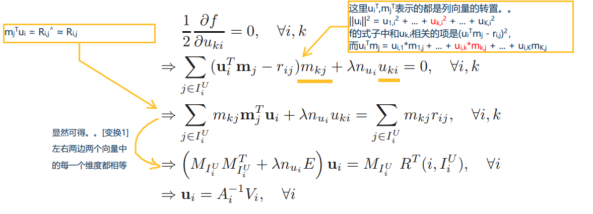
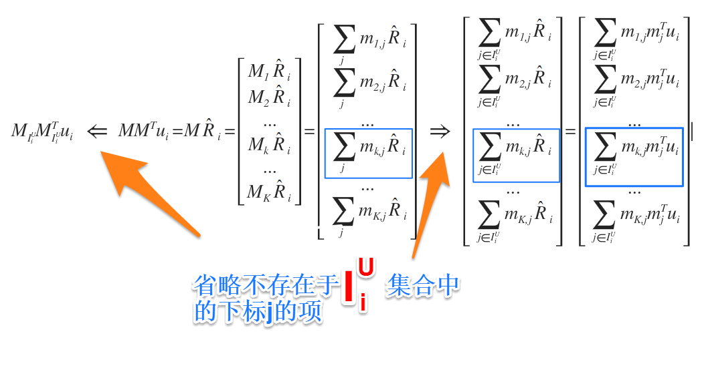

# ALS 求导过程推导
内容主要是对发表ALS方法的论文[1]做一些整理、摘录。所以符号表示方式上，尽量跟论文一致。

## 0.符号表示

|          符号           |           含义 / 解释          |
|     :-----------:      |         :-------------         |
|  | 用户数量  | 
|  | 电影数量  |
|  | 隐含特征个数 |
|  | 评分矩阵,     表示用户  对电影  的评分 |
|  | （用户，特征）矩阵，     表示用户   对隐含特征  的喜好程度， **列向量**  中包含的所有隐含特征刻画了用户i在推荐系统中的表示形式 |
|  | （特征，电影）矩阵，     表示电影  符合隐含特征  的程度， **列向量**  中包含的所有隐含特征刻画了电影j在推荐系统中的表示形式 |
|  | 原始评分矩阵中有评分存在的  对，即（用户， 电影）元组的集合 |
|  | 用户  评价过的**所有电影**的下标组成的集合 |
|  | 评价过电影  的**所有用户**下标组成的集合 |
|  | 从电影特征矩阵  中抽取用户  评价过的所有电影的特征向量，组成一个小型矩阵  |
|  | 从用户特征矩阵  中抽取所有评价过电影  的用户的特征向量，组成一个小型矩阵  |                             
|  | 用户  **真实评价过**的分数组成的行向量，是行向量  的一部分 |
|  | 电影  的所有真实评分组成的列向量，是列向量  的一部分 |  
|  | 单位矩阵，   |

## 1.推荐系统矩阵分解

在推荐系统的矩阵分解方法中，原始评分矩阵R被分解成了U和M两个矩阵。

    

    

    

    

<!--
### 模型的评估和优化
-->

### 1.1. 损失函数（loss function）

采用平方误差（square loss）函数来评估推荐结果对单个评分的损失值

    

>其中  表示的都是列向量，而 
表示列向量的转置。

对损失函数作正则化处理，有：

    

### 1.2. 目标函数（objective function）

累加所有原始评分矩阵中**出现过的分数**的误差，得到目标函数：

    

>注解：由于在  中， 贡献了一次，那么在行向量  的损失  中， 会贡献  次。同理，在列向量  的损失  中， 会贡献  次。

### 1.3. 成本函数（cost function）

模型的成本函数（经验风险）可以用RMSE（root-mean-square error 均方根差）表示为：

    

>* 该方法用于评估训练集时，误差被称为RMSD（root-mean-square deviation 均方根偏差）
>* 该方法用于评估测试集时，误差被称为RMSE（root-mean-square error 均方根误差）

即对原始评分矩阵中（除去空值）所有**出现过的评分**和预测评分的【均方误差的值】开根号。该值越接近0，模型的效果越好。发表ALS方法的论文[1]称，用1000个隐含特征作矩阵分解，并用ALS的方法训练，在netflix prize dataset上得到的RMSE为0.8985。

>评分的范围为1分到5分，假如用模型预测出来的每个预测值和**真实值**都有2分的误差，那么该模型的RMSE为2
>

    

## 2.ALS求导
ALS (alternating-least-squares 交替最小平方)的训练步骤是： 
1.  用较小的随机数初始化矩阵U和M。用每一部电影的平均评分（注意排除空值）作为该电影的第一个隐含特征。
2. 固定M，用**目标函数**对矩阵U的偏导数，优化矩阵U
3. 固定U，用**目标函数**对矩阵M的偏导数，优化矩阵M
4. 重复step2, step3，直到满足停止条件（例如训练集上的RMSD足够小）

以下着重关注求导部分

    

以上式子出现的 等变量的说明，见 [0.符号表示](#0符号表示)

[变换1]的说明

<!--

    

-->

### 2.1. 列向量ui的更新

    

    

    

    

### 2.2. 列向量mj的更新

    

    

    

    

## 3.Python代码实现（慎点）

## 4.实验结果

## 5.Netflix Prize 简述

>The Netflix Prize is a large-scale data mining competition held by Netflix
for the best recommendation system algorithm for predicting user ratings on
movies, based on a training set of more than 100 million ratings given by over
480,000 users to 17,700 movies. Each training data point consists of a quadruple
(user, movie, date, rating) where rating is an integer from 1 to 5. The test
dataset consists of 2.8 million data points with the ratings hidden. The goal is
to minimize the RMSE (root mean squared error) when predicting the ratings
on the test dataset. Netflix's own recommendation system (CineMatch) scores
0.9514 on the test dataset, and the grand challenge is to improve it by 10%.

摘自论文[1]中的描述，大致状况就是：在2006年的时候，Netflix公司发布了个百万美元大赛，只要能够做到比它们原来的推荐系统的性能更优10%（用RMSE衡量是0.85626），即可拿奖。2008年，利用ALS的方法，在Linux服务器集群上利用GPU矩阵运算，该论文的作者们取得了5.91%的提升。最终这个提升10%的难题在2009年才被解决[2]。

## 6.Reference
1. [Large-Scale Parallel Collaborative Filtering for the Netflix Prize](https://scholar.google.com/scholar?hl=en&as_sdt=0%2C5&q=Large-Scale+Parallel+Collaborative+Filtering+for+the+Netflix+Prize&btnG=) 
2. [Netflix Prize](https://www.netflixprize.com/)
3. [NetFlix百万美金数据建模大奖的故事](https://mp.weixin.qq.com/s?src=3&timestamp=1543407206&ver=1&signature=ZFCFiBH6wqYd0X*s6hU3mhvmyiVrrVpOK5sbGgAku7JjMq0430qfHiDGUdacIO8bYlHLakerpzZMUPNMUIjyW2I06v6V359eUCIldOySPvOBELOwEygw9b1ZEmZDRVWJE8sqDTYYNmV1aWmwy0UZVw==)

